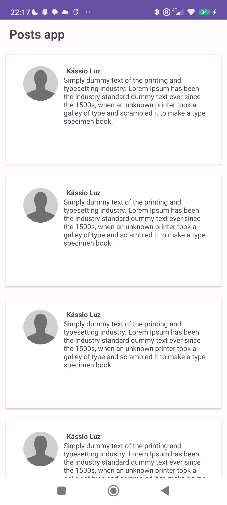

# Desafio 3

### Layout

<table>
  <tr>
    <td>
      
    </td>
  </tr>
</table>

Sabemos que a comunicação com a API pode demorar um tempo, e por isso o usuário deve receber algum tipo de feedback para entender o que está acontecendo. A forma mais normal de fazer isso é exibir um _loading_ enquanto a resposta está sendo carregada.

Além disso, vamos introduzir o conceito de navegação em telas e ter mais do que uma `Activity` no nosso app.

Por isso, para esse desafio, vamos fazer a integração com a API JSON Placeholder.

<table>
  <tr>
   <td>API<td>
   <td>
    [https://jsonplaceholder.typicode.com/](https://jsonplaceholder.typicode.com/)
   </td>
  </tr>
</table>

<table>
  <tr>
    <td>
      Endpoint
    </td>
    <td>
      [https://jsonplaceholder.typicode.com/posts](https://jsonplaceholder.typicode.com/posts)
    </td>
  </tr>
  <tr>
    <td>
    </td>
    <td>
      [https://jsonplaceholder.typicode.com/comments?postId=IDPOST](https://jsonplaceholder.typicode.com/comments?postId=IDPOST)
    </td>
  </tr>
</table>

A ideia é que, enquanto a API não tiver retornado a resposta, o app deve exibir a lista de posts e de comentários como um _Skeleton Content Loader_.

A primeira página deve ser a lista de Posts. Ao clicar em um post da lista, deve abrir uma nova página, com o post na parte superior e logo abaixo a lista de comentários do post.

## O que estudar

Para concluir esse desafio, você vai precisar dos conhecimentos adquiridos no primeiro e segundo desafio, por isso relembre os itens necessários:

- RecyclerView
- Ciclo de Vida
- Retrofit

Também serão necessários novos conhecimentos, como:

- Navegação entre Activities
- Envio de dados entre Activities

**Obs:** Para o layout da aplicação, busque inspiração em apps que tenham feeds de posts, como Twitter, Threads, Instagram.
